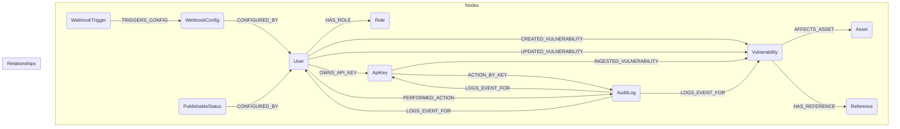
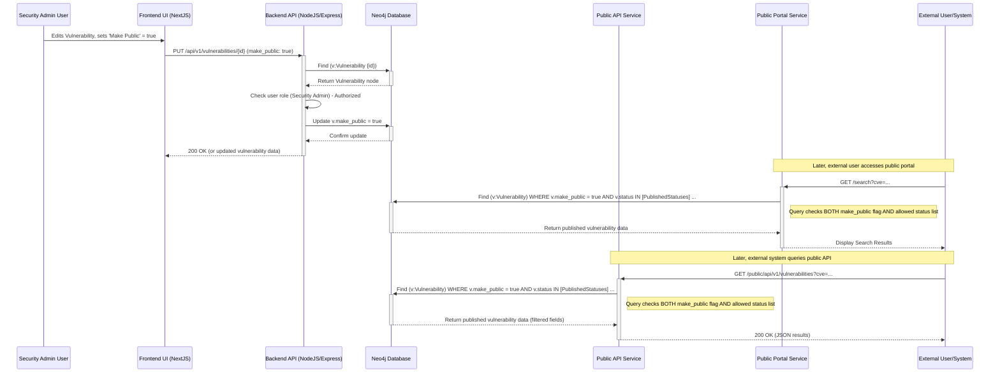

# Product Requirements Document: Enterprise CVE Management System

**Version:** 1.0
**Date:** 2024-08-29

## 1. Introduction

This document outlines the requirements for an open-source Enterprise CVE Management System. The system enables organizations to create, maintain, track, and selectively publish vulnerability information related to both their internal assets and third-party software they utilize. It aims to provide a centralized, secure repository for vulnerability data, incorporating inputs from manual entry and security scanners, and offering controlled public disclosure capabilities.

## 2. Goals

- Provide a robust platform for enterprises to manage vulnerability lifecycle information.
- Support multiple data input methods (manual, API, file upload).
- Enable clear tracking of vulnerability status and associated metadata (CWE, CPE).
- Implement role-based access control for security and segregation of duties.
- Offer mechanisms for controlled public disclosure of specific vulnerability information via a web portal and API.
- Ensure auditability of actions performed within the system.
- Provide extensibility through webhooks for integration with other systems (e.g., notification platforms).
- Develop the system as open-source to foster community contribution and adoption.

## 3. Functional Requirements

(Derived from `function_spec.md`)

### 3.1. Core Vulnerability Management

- CRUD operations (Create, Read, Update, Delete) for vulnerability records.
- Support for all data fields specified in Section 4 of `function_spec.md`.
- Implementation of the fixed status list defined in Section 5 of `function_spec.md`.

### 3.2. Data Input Methods

- **Manual Entry:** Intuitive UI forms for Security Admins to create/edit vulnerability records.
- **Scanner API Ingestion:**
  - Dedicated API endpoint (`/api/v1/scanner/ingest`) accepting POST requests.
  - Requires authentication via API Key passed in a request header (e.g., `X-API-Key`).
  - Expects a specific JSON payload format (detailed in API Specifications).
  - Creates new vulnerability records upon successful ingestion, defaulting status to 'Received'.
- **File Upload:**
  - UI feature for Security Admins to upload files (CSV, JSON, XML).
  - System must parse these files and create/update vulnerability records accordingly.
  - Clear feedback on upload success, failure, and partial processing.

### 3.3. User Roles and Permissions

- Implementation of the three roles (System Admin, Security Admin, User) with the exact permissions defined in Section 6 of `function_spec.md`.
- Secure user authentication (login/password) and session management.
- **Initial Setup:** The first System Admin user account must be created via a dedicated command-line interface (CLI) script during initial application setup/deployment.

### 3.4. User Interface (UI)

- **Dashboard:** Visual overview of key metrics (e.g., counts by status/severity).
- **Vulnerability List:** Searchable, filterable, sortable table view of vulnerabilities. Supports pagination for large datasets.
- **Detailed View:** View showing all fields for a single vulnerability record.
- **Admin Interfaces:** Specific sections for System Admins (User Management, Webhook Config) and Security Admins (API Key Management, Publishable Status Config).

### 3.5. Searching and Filtering

- Implement combined filtering capabilities on the vulnerability list as specified in Section 8 of `function_spec.md`.
- Search should be performant even with a large number of records.

### 3.6. Publication / External Sharing

- **Public Web Portal:**
  - Separate, read-only web interface.
  - Searchable list of published vulnerabilities.
  - Displays selected fields suitable for public consumption.
- **Public API:**
  - Read-only REST API endpoint (`/public/api/v1/vulnerabilities`).
  - Allows querying of published vulnerabilities.
  - Supports filtering based on public data fields (e.g., CVE ID, CPE).
  - Implements pagination.
- **Publication Control:** Enforce the dual control mechanism (explicit "Make Public" flag + eligible Status) as defined in Section 9 of `function_spec.md`.

### 3.7. Audit Logging

- Implement comprehensive audit logging as detailed in Section 10 of `function_spec.md`.
- Audit logs should be stored securely and be accessible for review (potentially restricted to specific admin roles).

### 3.8. Webhooks

- Implement configurable webhooks as detailed in Section 11 of `function_spec.md`.
- System Admin manages webhook endpoint URLs and event triggers via the UI.
- Webhook payloads should be in JSON format and include event type and relevant vulnerability data.

## 4. Non-Functional Requirements

- **Performance:**
  - UI interactions (search, filter, load lists) should be responsive (< 2 seconds for typical operations).
  - API responses (Internal, Scanner, Public) should be timely (< 1 second under moderate load).
  - File uploads should process reasonably quickly, potentially as background jobs for large files.
- **Scalability:** The system should be able to handle a growing number of vulnerabilities (tens to hundreds of thousands) and users without significant performance degradation. Database queries should be optimized.
- **Reliability:** The system should be stable and available. Database backups and recovery procedures should be considered.
- **Maintainability:** Code should be well-structured, documented, and follow best practices for the chosen technology stack to facilitate future development and contributions.
- **Security:** Adhere to security best practices (see Section 9).
- **Usability:** The UI should be intuitive and require minimal training for users within their roles.

## 5. High-Level Architecture

- **General Approach:** A web application architecture will be implemented using the following technologies:
  - **Backend:** **NodeJS with the Express framework** for the API service handling business logic, data persistence, authentication, and authorization.
  - **Frontend:** **NextJS (React framework)** for the Single Page Application (SPA) providing the user interface.
  - **Database:** **Neo4j Graph Database** for storing vulnerability data, user information, and their relationships.
- **Public Portal/API Deployment:** The Public Web Portal and Public API components **must be deployed as a separate service** from the core internal application backend/frontend. This service will interact with the Neo4j database (potentially via a dedicated read-only connection or replica if performance dictates) to access only explicitly published vulnerability data.
- **Asynchronous Tasks:** Use a task queue suitable for the NodeJS ecosystem (e.g., BullMQ, Kue) integrated with Redis for handling potentially long-running operations like large file uploads/processing or sending webhook notifications.
- **Containerization:** The entire application stack (Backend, Frontend, Public Portal/API, Database, Task Queue/Redis) **must be containerized using Docker** and orchestrated using Docker Compose (for development/simple deployments) or Kubernetes (for scalable production deployments).

**System Architecture Diagram:**

```mermaid
graph TD
    subgraph "User Browser"
        UI(NextJS Frontend SPA)
    end

    subgraph "Internal Network / Private Cloud"
        B(NodeJS/Express Backend API)
        DB[(Neo4j Database)]
        Q[(Task Queue / Redis)]
        UI -->|API Calls (HTTPS)| B
        B -->|DB Queries| DB
        B -->|Queue Jobs| Q
        Q -->|Processes Jobs| B
        B -->|Webhook Calls (HTTPS)| ExtW[External Webhook Listeners]
    end

    subgraph "DMZ / Public Cloud"
        PubPort(Public Portal - NextJS/Static)
        PubAPI(Public API - NodeJS/Express)
        PubPort -->|Reads Published Data (DB)| DB
        PubAPI -->|Reads Published Data (DB)| DB
    end

    subgraph "External Systems"
        Scan(Security Scanners)
        PubUser(Public Users / Systems)
        ExtW
    end

    Scan -->|Scanner API (HTTPS + API Key)| B
    PubUser -->|HTTPS| PubPort
    PubUser -->|Public API (HTTPS)| PubAPI

    style DB fill:#f9d,stroke:#333,stroke-width:2px
    style Q fill:#ccf,stroke:#333,stroke-width:2px
```

**Deployment Diagram (Conceptual Docker/Kubernetes):**

```mermaid
graph TD
    subgraph "Orchestration (Docker Compose / Kubernetes)"
        direction LR
        subgraph "Internal Services"
            direction TB
            F_SVC[Frontend Service/Pods\n(NextJS)]
            B_SVC[Backend Service/Pods\n(NodeJS/Express)]
            Q_SVC[Queue Worker Service/Pods\n(NodeJS)]
        end

        subgraph "Public Services"
            direction TB
            PP_SVC[Public Portal Service/Pods\n(NextJS/Static)]
            PA_SVC[Public API Service/Pods\n(NodeJS/Express)]
        end

        subgraph "Data & State Stores"
            direction TB
            DB_SVC[Neo4j Service/StatefulSet]
            RD_SVC[Redis Service/StatefulSet\n(for Task Queue)]
        end

        NET[Network Policies / Ingress / Load Balancer]

        NET --> F_SVC
        NET --> B_SVC
        NET --> PP_SVC
        NET --> PA_SVC

        F_SVC --> B_SVC
        B_SVC --> DB_SVC
        B_SVC --> RD_SVC
        Q_SVC --> B_SVC
        Q_SVC --> RD_SVC
        PP_SVC --> DB_SVC
        PA_SVC --> DB_SVC
    end

    U(Users) --> NET
    S(Scanners) --> NET
    PU(Public Users/APIs) --> NET

    style DB_SVC fill:#f9d,stroke:#333,stroke-width:2px
    style RD_SVC fill:#ccf,stroke:#333,stroke-width:2px
```

## 6. Data Model / Schema (Conceptual Graph Model for Neo4j)

_(Specific Cypher queries and property definitions will be developed during implementation)_

**Nodes:**

- **`(v:Vulnerability)`**: Represents a vulnerability instance.
  - Properties: `id` (unique UUID), `cve_id` (string, indexed, unique constraint if not null), `description` (string), `severity_rating` (string, e.g., 'Critical', 'High'), `status` (string, indexed), `discovery_date` (datetime), `report_date` (datetime), `source` (string), `cwe_ids` (list of strings), `cpe_names` (list of strings), `make_public` (boolean, default false, indexed), `created_at` (datetime), `updated_at` (datetime).
- **`(u:User)`**: Represents a user account.
  - Properties: `id` (unique UUID), `username` (string, unique constraint, indexed), `password_hash` (string), `email` (string, unique constraint, indexed), `is_active` (boolean), `created_at` (datetime), `updated_at` (datetime).
- **`(r:Role)`**: Represents a user role.
  - Properties: `name` (string, unique constraint - 'System Admin', 'Security Admin', 'User').
- **`(k:ApiKey)`**: Represents an API key for scanner integration.
  - Properties: `id` (unique UUID), `key_hash` (string, unique constraint - store hash, not raw key), `description` (string), `is_active` (boolean), `created_at` (datetime), `revoked_at` (datetime, nullable).
- **`(a:Asset)`**: Represents an internal asset mentioned in a vulnerability. _Note: Explicit node only if tracking assets becomes more complex later. For v1.0, `internal_asset_name` can remain a property on `Vulnerability`._ If implementing as a node:
  - Properties: `name` (string, unique constraint, indexed).
- **`(ref:Reference)`**: Represents an external reference URL. _Note: Potentially store as a list property on `Vulnerability` for simplicity in v1.0 unless relationship tracking is needed._ If implementing as a node:
  - Properties: `url` (string, unique constraint).
- **`(log:AuditLog)`**: Represents an audit log entry.
  - Properties: `id` (unique UUID), `timestamp` (datetime, indexed), `action_type` (string), `target_node_type` (string), `target_node_id` (string), `details` (string - JSON recommended).
- **`(wc:WebhookConfig)`**: Represents a configured webhook endpoint.
  - Properties: `id` (unique UUID), `target_url` (string), `is_active` (boolean), `created_at` (datetime).
- **`(wt:WebhookTrigger)`**: Represents an event type that triggers a webhook.
  - Properties: `event_type` (string, unique constraint, e.g., 'NEW_VULNERABILITY').
- **`(ps:PublishableStatus)`**: Represents a status eligible for publication.
  - Properties: `status_name` (string, unique constraint).

**Relationships:**

- **`[:HAS_ROLE]`**: `(u:User)-[:HAS_ROLE]->(r:Role)`
- **`[:CREATED_VULNERABILITY]`**: `(u:User)-[:CREATED_VULNERABILITY {timestamp: datetime}]->(v:Vulnerability)`
- **`[:INGESTED_VULNERABILITY]`**: `(k:ApiKey)-[:INGESTED_VULNERABILITY {timestamp: datetime}]->(v:Vulnerability)`
- **`[:UPDATED_VULNERABILITY]`**: `(u:User)-[:UPDATED_VULNERABILITY {timestamp: datetime}]->(v:Vulnerability)`
- **`[:AFFECTS_ASSET]`**: `(v:Vulnerability)-[:AFFECTS_ASSET]->(a:Asset)` (If `Asset` node is used)
- **`[:HAS_REFERENCE]`**: `(v:Vulnerability)-[:HAS_REFERENCE]->(ref:Reference)` (If `Reference` node is used)
- **`[:OWNS_API_KEY]`**: `(u:User)-[:OWNS_API_KEY]->(k:ApiKey)` (User is Security Admin who created it)
- **`[:PERFORMED_ACTION]`**: `(u:User)-[:PERFORMED_ACTION]->(log:AuditLog)`
- **`[:ACTION_BY_KEY]`**: `(k:ApiKey)-[:ACTION_BY_KEY]->(log:AuditLog)`
- **`[:LOGS_EVENT_FOR]`**: `(log:AuditLog)-[:LOGS_EVENT_FOR]->(targetNode)` (Where targetNode is User, Vulnerability, ApiKey etc.)
- **`[:CONFIGURED_BY]`**: `(wc:WebhookConfig)-[:CONFIGURED_BY]->(u:User)` (User is System Admin)
- **`[:TRIGGERS_CONFIG]`**: `(wt:WebhookTrigger)-[:TRIGGERS_CONFIG]->(wc:WebhookConfig)`
- **`[:CONFIGURED_STATUS]`**: `(ps:PublishableStatus)-[:CONFIGURED_BY]->(u:User)` (User is Security Admin)

**Indexing:** Apply appropriate indexes (e.g., on `Vulnerability.cve_id`, `Vulnerability.status`, `User.username`, `User.email`) and unique constraints as noted above to ensure data integrity and query performance.

**Conceptual Graph Data Model Diagram:**



## 7. API Specifications

### 7.1. Internal API (for UI)

- **Authentication:** Session-based or Token-based (e.g., JWT) authentication for logged-in users.
- **Authorization:** Enforce role-based access control on all endpoints.
- **Format:** JSON request/response bodies.
- **Endpoints (Examples):**
  - `/api/v1/vulnerabilities` (GET: list/search, POST: create)
  - `/api/v1/vulnerabilities/{id}` (GET: details, PUT/PATCH: update, DELETE: delete)
  - `/api/v1/users` (GET: list, POST: create)
  - `/api/v1/users/{id}` (GET: details, PUT/PATCH: update, DELETE: delete)
  - `/api/v1/api-keys` (GET: list, POST: generate)
  - `/api/v1/api-keys/{id}` (DELETE: revoke)
  - `/api/v1/webhooks` (GET: list configs, POST: create config)
  - `/api/v1/webhooks/{id}` (PUT/PATCH: update, DELETE: delete)
  - `/api/v1/settings/publishable-statuses` (GET: list, POST: add, DELETE: remove)
  - `/api/v1/auth/login` (POST)
  - `/api/v1/auth/logout` (POST)
  - `/api/v1/dashboard/stats` (GET)
  - ... (Define endpoints for all required CRUD and administrative actions)

### 7.2. Scanner API (Incoming)

- **Endpoint:** `POST /api/v1/scanner/ingest`
- **Authentication:** Requires `X-API-Key` header with a valid, active API key.
- **Request Body (JSON):**
  ```json
  {
    "cve_id": "CVE-2023-99999", // Optional
    "description": "Description of the vulnerability found by scanner.",
    "severity_rating": "High", // Required - Qualitative Rating (e.g., Critical, High, Medium, Low, Informational)
    "references": [
      // Optional
      "http://scanner.example.com/vuln/123",
      "http://vendor.example.com/advisory/abc"
    ],
    "internal_asset_name": "Server-Prod-01 (192.168.1.100)", // Required if applicable
    "discovery_date": "2024-08-29T10:00:00Z", // Optional - ISO 8601 Format
    "source": "ScannerX v2.1", // Recommended
    "cwe_ids": ["CWE-79", "CWE-89"], // Optional
    "cpe_names": ["cpe:2.3:a:vendor:product:1.2:*:*:*:*:*:*:*"], // Optional
    "scanner_specific_details": {
      // Optional - flexible structure for extra details
      "port": 443,
      "protocol": "TCP",
      "finding_details": "..."
    }
  }
  ```
- **Responses:**
  - `201 Created`: Successfully processed and created vulnerability record. Body may contain the ID of the created record.
  - `400 Bad Request`: Invalid JSON format, missing required fields, or validation errors. Response body should detail errors.
  - `401 Unauthorized`: Missing or invalid API Key.
  - `500 Internal Server Error`: Server-side processing error.

**Scanner Data Ingestion Flow Diagram:**

```mermaid
sequenceDiagram
    participant Scan as Security Scanner
    participant BE as Backend API (NodeJS/Express)
    participant DB as Neo4j Database
    participant AL as Audit Logger
    participant WH as Webhook Service

    Scan->>+BE: POST /api/v1/scanner/ingest (JSON Payload, X-API-Key)
    BE->>BE: Validate API Key (check hash in DB)
    alt Invalid Key
        BE-->>-Scan: 401 Unauthorized
    else Valid Key
        BE->>BE: Validate JSON Payload
        alt Invalid Payload
            BE-->>-Scan: 400 Bad Request
        else Valid Payload
            BE->>+DB: Create (v:Vulnerability) node with properties
            DB-->>-BE: Return new Vulnerability node ID
            BE->>+DB: Create [:INGESTED_VULNERABILITY] relationship from ApiKey node to new Vulnerability node
            DB-->>-BE: Confirm relationship creation
            BE-->>Scan: 201 Created (Vulnerability ID)
            BE->>+AL: Log 'Vulnerability Ingested' event (ApiKey, Vuln ID)
            AL-->>-BE: Log confirmation
            BE->>+WH: Check if 'NEW_VULNERABILITY' triggers webhook
            alt Webhook Triggered
                WH->>WH: Send webhook notification (async)
            end
        end
    end

```

### 7.3. Public API (Outgoing)

- **Endpoint:** `GET /public/api/v1/vulnerabilities`
- **Authentication:** None (public access).
- **Query Parameters (Examples):** `cve_id`, `cpe_name`, `published_since` (date), `severity`, `limit`, `offset` (for pagination).
- **Response Body (JSON):** Array of published vulnerability objects containing only fields deemed safe for public disclosure (e.g., CVE ID, Description, Severity, References, CPEs, Published Date). Exclude internal asset names, internal statuses, audit info.
  ```json
  {
    "count": 150,
    "next": "/public/api/v1/vulnerabilities?limit=50&offset=50",
    "previous": null,
    "results": [
      {
        "cve_id": "CVE-2023-11111",
        "description": "Public description...",
        "severity_rating": "Critical",
        "references": ["http://..."],
        "cpe_names": ["cpe:2.3:..."],
        "published_date": "2024-08-01T12:00:00Z"
      }
      // ... more results
    ]
  }
  ```
- **Responses:**
  - `200 OK`: Successful query.
  - `400 Bad Request`: Invalid query parameters.
  - `500 Internal Server Error`: Server-side processing error.
- **Considerations:** Implement rate limiting to prevent abuse.

**Vulnerability Publication Flow Diagram:**



## 8. File Upload Handling

- **Formats:** Support CSV, JSON (array of objects similar to Scanner API payload), and potentially XML.
- **Parsing:** Implement robust parsers for each format.
- **Mapping:** The system will expect **predefined, specific column headers or field names** within the uploaded files. These required formats must be clearly documented for users.
- **Duplicate Handling:** Define strategy for handling records in the file that potentially match existing records in the database (e.g., match on CVE ID). The default strategy will be to **update**, meaning the existing record in the database will be **overwritten** with the data provided in the uploaded file for that record. Alternative strategies (skip, flag for review) may be considered for future versions.
- **Error Handling:** Report errors clearly (e.g., file-level errors like invalid format or headers, row-level errors like validation failures). Process valid rows even if some rows have errors. Provide a summary report after processing.
- **Background Processing:** For large files, process uploads asynchronously in the background and notify the user upon completion.

## 9. Error Handling Strategy

- **API Responses:** Use standard HTTP status codes consistently (e.g., 400, 401, 403, 404, 500). Return JSON error bodies with a clear error message and optionally an internal error code for easier debugging.
  ```json
  // Example 400 Bad Request
  {
    "error": {
      "code": "VALIDATION_ERROR",
      "message": "Validation failed.",
      "details": {
        "cve_id": ["Invalid CVE ID format."],
        "email": ["Enter a valid email address."]
      }
    }
  }
  ```
- **UI Feedback:** Provide user-friendly error messages in the UI for failed actions, validation errors, etc. Avoid exposing raw stack traces or overly technical details.
- **Logging:** Log all significant errors (API errors, database errors, file processing errors, webhook failures) with sufficient context (stack traces where applicable) for debugging.

## 10. Security Considerations

- **Authentication & Authorization:** Secure password hashing (e.g., bcrypt, Argon2). Enforce role-based access rigorously on all API endpoints and UI actions. Protect against session hijacking.
- **API Security:**
  - Use HTTPS exclusively.
  - Securely store/manage API keys (hash the keys in the database).
  - Implement rate limiting on all public and scanner APIs.
  - Validate all incoming API data thoroughly.
- **Input Validation:** Sanitize and validate _all_ user/API input to prevent common web vulnerabilities (XSS, SQL Injection, Command Injection, etc.). Use appropriate libraries/framework features.
- **Data Security:** Protect sensitive data at rest (e.g., consider database encryption options) and in transit (HTTPS). Be mindful of what data is included in logs and audit trails.
- **Dependency Management:** Keep all software dependencies (OS, libraries, frameworks) up-to-date and scan for known vulnerabilities.
- **Audit Log Integrity:** Ensure audit logs cannot be easily tampered with (e.g., append-only storage, restricted access).
- **Public Interface Security:** Treat the public portal and API as untrusted boundaries. Minimize the attack surface and ensure they only expose intended data.

## 11. Testing Plan

- **Unit Testing:** All major functions, classes, modules in the backend (business logic, data access, utility functions) and frontend (components, state management logic) should have comprehensive unit tests. Aim for high code coverage.
- **Integration Testing:** Test the interaction between components:
  - API endpoints interacting with the database.
  - API endpoint authentication and authorization logic.
  - Frontend components making calls to the backend API.
  - Webhook sending mechanism.
- **End-to-End (E2E) Testing:** Use tools like Selenium, Cypress, or Playwright to simulate user workflows:
  - Login/Logout for different roles.
  - Creating, viewing, updating, deleting vulnerabilities.
  - Searching and filtering.
  - Managing users and API keys (Admin flows).
  - Uploading a file and verifying results.
  - Verifying public portal/API content based on publication rules.
- **Security Testing:**
  - Perform vulnerability scanning using automated tools (e.g., OWASP ZAP, Nessus).
  - Conduct manual penetration testing, focusing on authentication, authorization, input validation, and API security.
  - Review dependencies for known vulnerabilities.
- **Performance Testing:**
  - Load test critical API endpoints (especially public and scanner APIs).
  - Test database query performance under load.
  - Measure UI responsiveness with large datasets.
- **Usability Testing:** Gather feedback from target users (representing different roles) on the UI/UX.

## 12. Future Considerations (Out of Scope for v1.0)

- Direct integration with NVD/MITRE feeds for automated data enrichment.
- More advanced, customizable reporting features.
- Integration with external asset management / CMDB systems.
- Implementation of a more complex workflow engine for vulnerability remediation.
- Support for CVSS v4.0 calculations/display.
- Multi-tenancy support.
- Advanced dashboard customization.
- Notifications system within the application (beyond webhooks).
